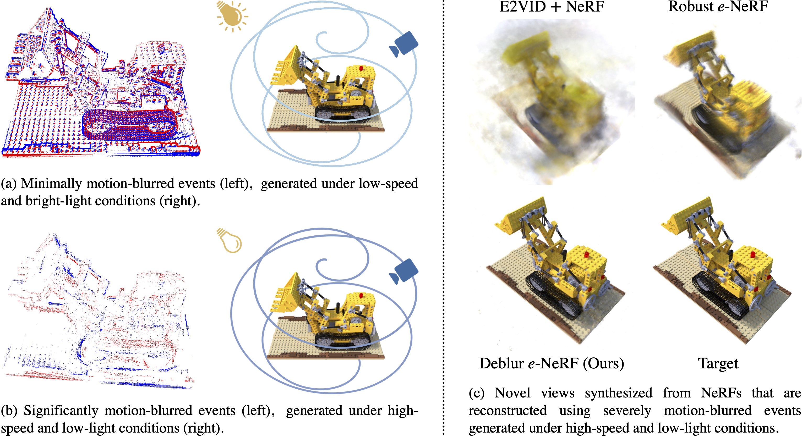

# Deblur *e*-NeRF

[](https://wengflow.github.io/deblur-e-nerf) &nbsp; [](https://arxiv.org/abs/2409.17988) &nbsp; [](https://github.com/wengflow/rpg_esim) &nbsp; [](https://huggingface.co/datasets/wengflow/deblur-e-nerf)

<p align="center">
   
</p>

This repository contains the source code for the ECCV 2024 paper — [Deblur *e*-NeRF: NeRF from Motion-Blurred Events under High-speed or Low-light Conditions](https://arxiv.org/abs/2409.17988), which is built on top of [Robust *e*-NeRF: NeRF from Sparse & Noisy Events under Non-Uniform Motion](https://wengflow.github.io/robust-e-nerf). Deblur *e*-NeRF is a novel method to directly and effectively reconstruct blur-minimal NeRFs from motion-blurred events, generated under high-speed motion or low-light conditions.

If you find Deblur *e*-NeRF useful for your work, please consider citing:
```bibtex
@inproceedings{low2024_deblur-e-nerf,
  title = {Deblur e-NeRF: NeRF from Motion-Blurred Events under High-speed or Low-light Conditions},
  author = {Low, Weng Fei and Lee, Gim Hee},
  booktitle = {European Conference on Computer Vision (ECCV)},
  year = {2024}
}
```

```bibtex
@inproceedings{low2023_robust-e-nerf,
  title = {Robust e-NeRF: NeRF from Sparse & Noisy Events under Non-Uniform Motion},
  author = {Low, Weng Fei and Lee, Gim Hee},
  booktitle = {Proceedings of the IEEE/CVF International Conference on Computer Vision (ICCV)},
  year = {2023}
}
```

## Installation

We recommend using [Conda](https://conda.io/) to set up an environment with the appropriate dependencies for running Deblur *e*-NeRF, as follows:

```bash
git clone https://github.com/wengflow/deblur-e-nerf.git
cd deblur-e-nerf
conda env create -f environment.yml
```

If a manual installation is preferred, the list of dependencies can be found in `environment.yml`.

## Dataset Setup

### Deblur *e*-NeRF Synthetic Dataset

Our synthetic experiments are performed on a set of sequences simulated using an [improved ESIM](https://github.com/wengflow/rpg_esim) event camera simulator with different camera configurations on NeRF Realistic Synthetic $360\degree$ scenes. In our [Deblur *e*-NeRF Synthetic Event Dataset](https://huggingface.co/datasets/wengflow/deblur-e-nerf), we provide the simulated sequences used to study the collective effect of camera speed and scene illuminance. Minor modifications to the ESIM configuration files provided in the dataset enables the simulation of other sequences used in our synthetic experiments.

To run Deblur *e*-NeRF on our synthetic dataset:

1. Setup the dataset according to the [official instructions](https://huggingface.co/datasets/wengflow/deblur-e-nerf#setup)
2. Preprocess each sequence in the raw dataset with:
   ```bash
   python scripts/preprocess_esim.py <sequence_path>/esim.conf <sequence_path>/esim.bag <sequence_path>
   ```

### EDS

Our qualitative real experiments are performed on the `07_ziggy_and_fuzz_hdr`, `08_peanuts_running` and `11_all_characters` sequences of the [EDS dataset](https://rpg.ifi.uzh.ch/eds.html), which are setup as follows:

1. Download the following raw data for each sequence and calibration file into a common folder:
   - `<sequence_name>.tgz`
   - `01_calib_results.zip`
2. Uncompress all `.tgz` and `.zip` archives into their own respective folders, and then remove the archives
3. Preprocess each sequence in the raw dataset with:
   ```bash
   python scripts/eds_to_esim.py <01_calib_results_path> <raw_dataset_path> <preprocessed_dataset_path>
   ```

## Usage

Train, validate or test Deblur *e*-NeRF with:
```bash
python scripts/run.py {train, val, test} <config_file_path>
```

## Configuration

In the `configs/` folder, we provide two sets of configuration files:

1. `{train, test}/synthetic.yaml`
2. `{train, test}/{07_ziggy_and_fuzz_hdr, 08_peanuts_running, 11_all_characters}.yaml`

used to train or test Deblur *e*-NeRF for the synthetic and real experiments, respectively.

The specific experimental setting described in the configuration files are given as follows:

| Configuration File | Experiment | Sequence | (Eff.) Batch Size | Opt. $C_p$ | Opt. $\tau$ | Opt. $\Omega$ | $\lambda_\mathit{tv}$ |
| :--- | :--- | :--- | :--- | :---: | :---: | :---: | :---: |
| `synthetic.yaml` | Synthetic | `chair` under the hard setting | $2^{17} = 131\ 072$ | ✗ | ✗ | ✗ | 0.001 |
| `<sequence_name>.yaml` | Real | `<sequence_name>` | $2^{20} = 1\ 048\ 576$ | ✓ | ✓ | ✓ | 0.1 |

You should modify the following parameters in the given configuration files to reflect the correct or preferred paths:
1. `data.dataset_directory`: Path to the preprocessed sequence
2. `model.checkpoint_filepath`: Path to the pretrained model
3. `logger.save_dir`: Preferred path to the logs

To reproduce our synthetic experiment results under any specific setting, as reported in the paper, you should modify `{train, test}/synthetic.yaml` as follows:
| Experimental Setting | Parameter(s) To Be Modified |
| :--- | :--- |
| Sequence | `data.dataset_directory` |
| (Effective) Batch Size | `data.train_eff_ray_sample_batch_size`, `trainer.limit_train_batches`, `trainer.accumulate_grad_batches` |
| Opt. $C_p$ | `model.contrast_threshold.freeze` |
| Opt. $\tau$  | `model.refractory_period.freeze` |
| Opt. $\Omega$  | `model.pixel_bandwidth.freeze` |
| $\lambda_\mathit{tv}$ | `loss.weight.log_intensity_tv` |
| Pixel Bandwidth Model | `model.pixel_bandwidth.enable` |
| Input Sample Size | `model.pixel_bandwidth.it_sample_size` |

You should also modify `model.checkpoint_filepath` and `logger.name` accordingly.

Note that in our synthetic experiments, when the pixel bandwidth model parameters $\Omega$ are jointly optimized, we poorly initialize them, by manually overriding the calibrated values, to assess the robustness of the joint optimization.

Please refer to the [Deblur *e*-NeRF paper](https://arxiv.org/abs/2409.17988) for more details.
